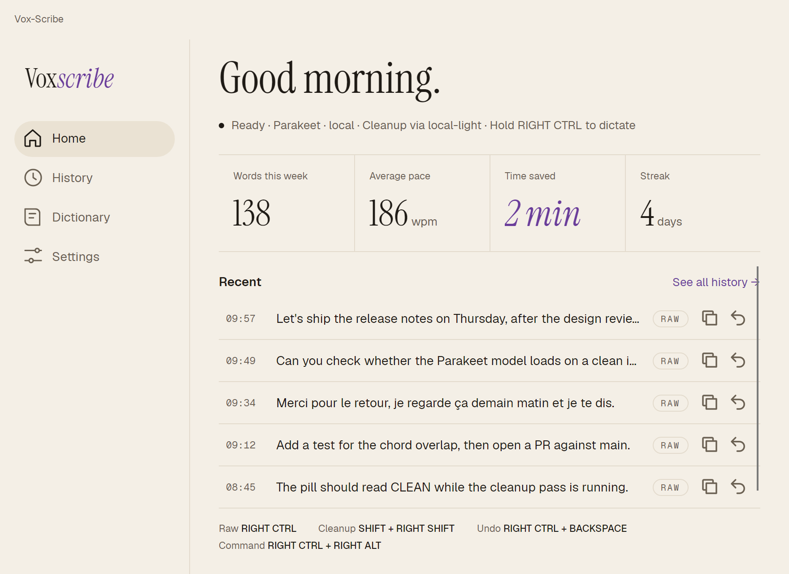
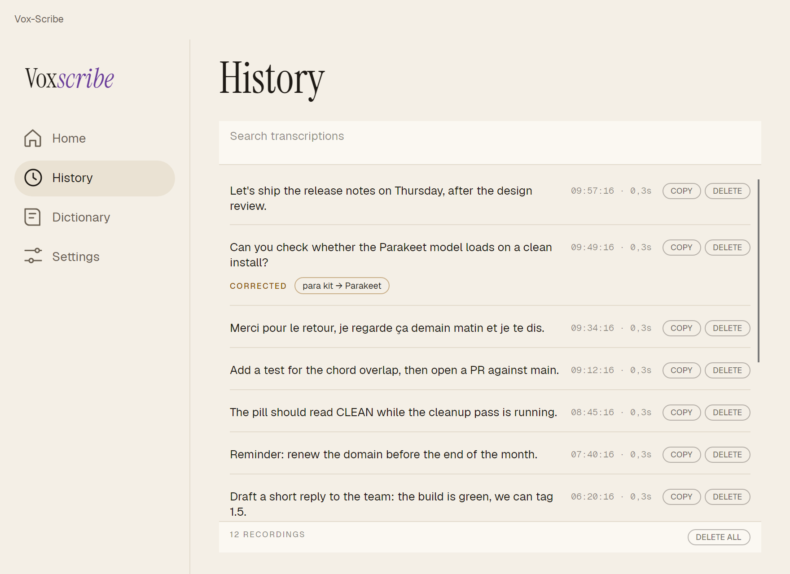
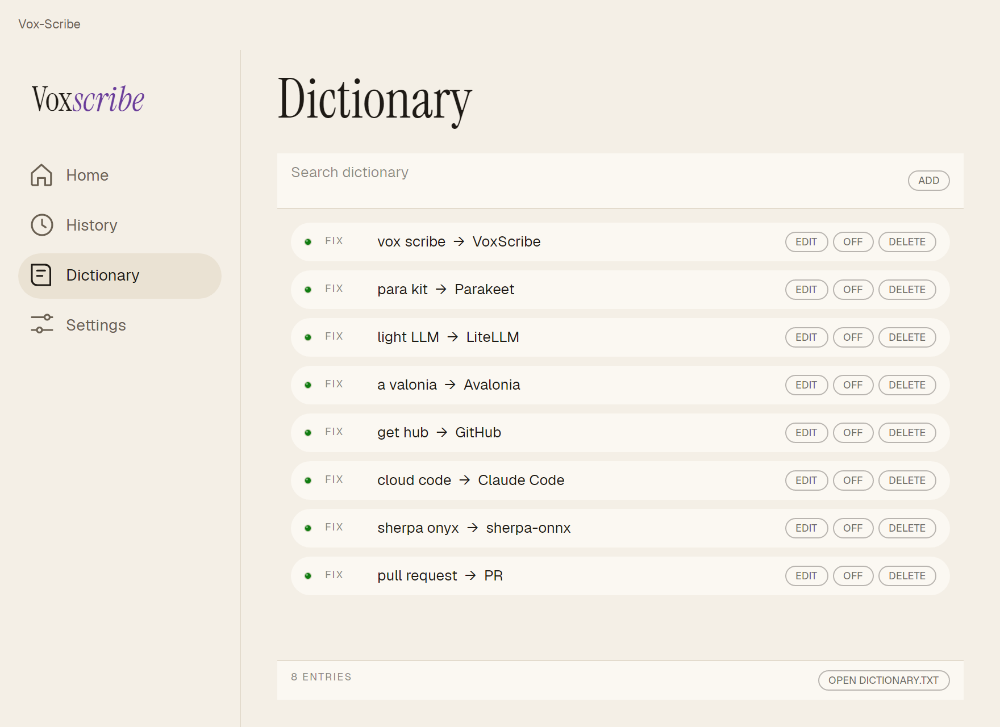
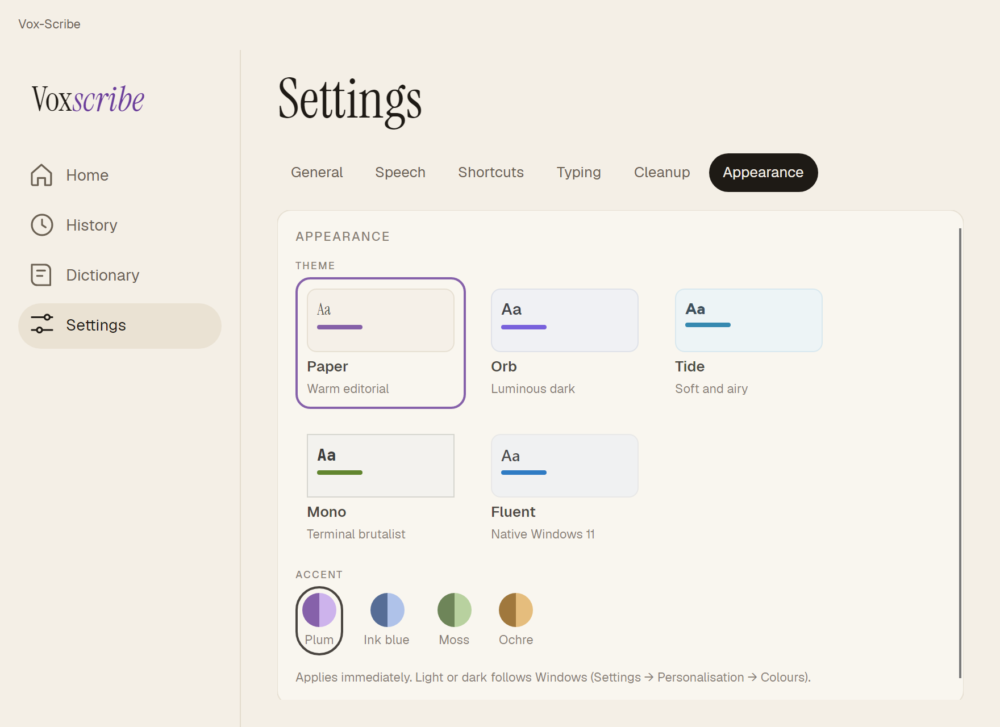
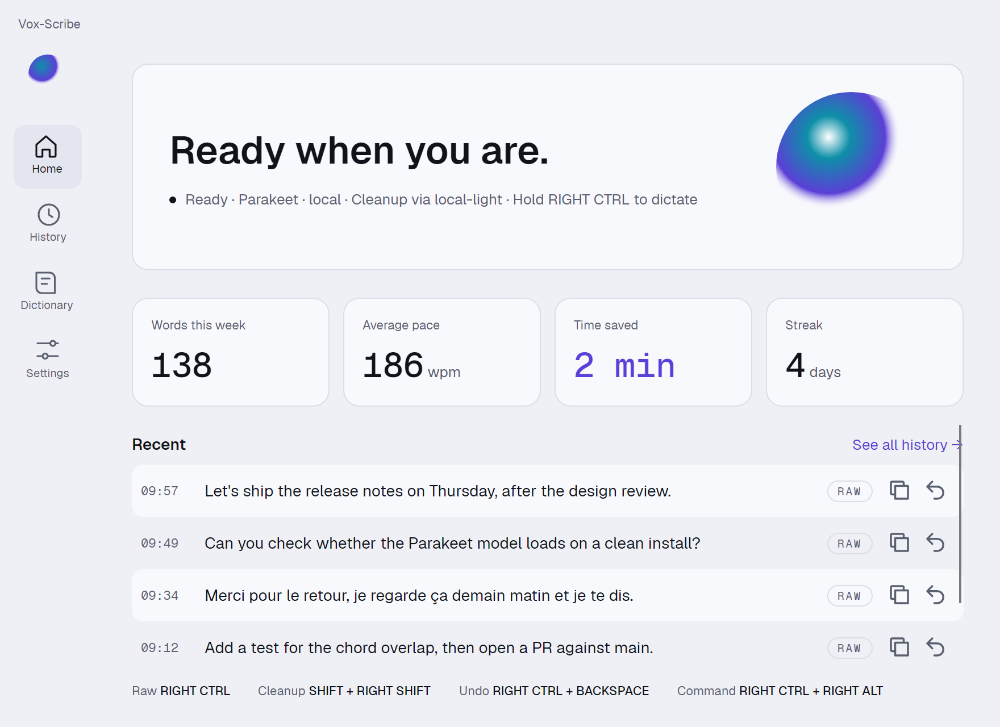
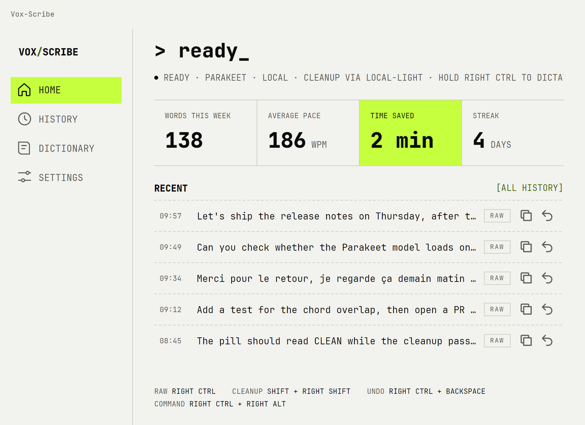
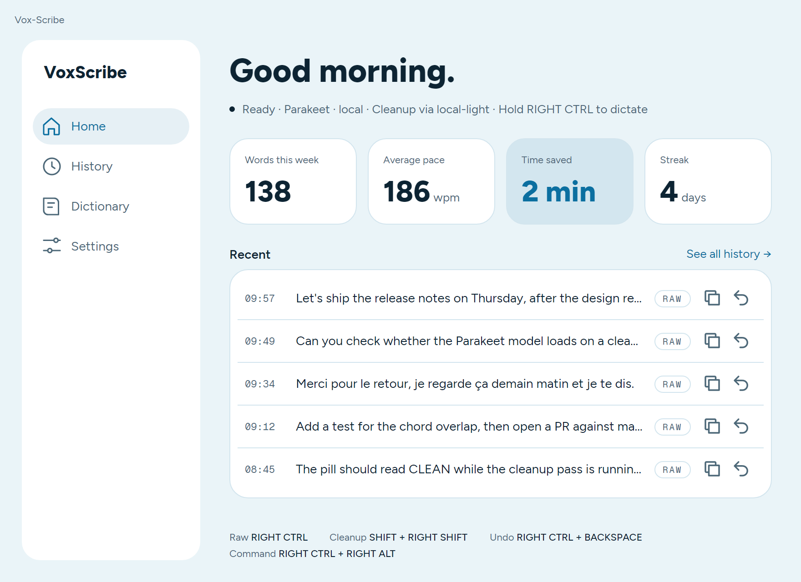
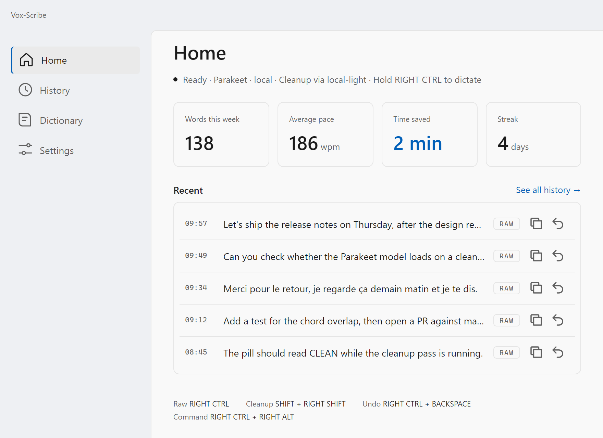

<div align="center">

<a href="#readme">
  <picture>
    <source media="(prefers-color-scheme: dark)" srcset="docs/assets/banner-dark.svg">
    
  </picture>
</a>

<br>

[](https://github.com/Arylmera/vox-scribe/releases/latest)


**Push-to-talk dictation for Windows.** Hold a key, talk, let go —<br>
and the sentence is typed into whatever had focus. Any app, any text field.

<br>

<a href="https://github.com/Arylmera/vox-scribe/releases/latest"></a>

<sub><a href="#-install">Install</a> · <a href="#-how-to-use-it">How to use it</a> · <a href="#-themes">Themes</a> · <a href="#-claude-code-reads-its-replies-aloud">Claude Code</a> · <a href="docs/GUIDE.md">User guide</a> · <a href="#-build-from-source">Build</a></sub>

</div>

<br>

<picture>
  <source media="(prefers-color-scheme: dark)" srcset="docs/assets/demo-dark.svg">
  
</picture>

## ✦ Why VoxScribe

<table>
<tr>
<td width="33%" valign="top">

**⚡ Transcribed while you talk**<br>
<sub>Phrases are transcribed as you speak, so the wait after you let go is the length of the last few words — not of the whole dictation.</sub>

</td>
<td width="33%" valign="top">

**🔒 On-device by default**<br>
<sub>Parakeet runs on your own processor through sherpa-onnx. Nothing leaves the machine, and nothing is downloaded until you ask.</sub>

</td>
<td width="33%" valign="top">

**✍️ Raw or cleaned — you choose as you speak**<br>
<sub>One shortcut types what was heard. Another sends it through a small language model first: punctuation, capitals, filler words gone.</sub>

</td>
</tr>
<tr>
<td valign="top">

**📖 A dictionary that learns your words**<br>
<sub>Names, jargon, product names: write the fix once (<code>para kit → Parakeet</code>) and it is applied every time — with suggestions from the fixes the cleanup model keeps making.</sub>

</td>
<td valign="top">

**🤖 Talks to Claude Code**<br>
<sub>A command chord types your prompt straight into Claude Code and presses Return. <code>/parle</code> and <code>/say</code> read its reply back to you.</sub>

</td>
<td valign="top">

**🎨 Five themes, light and dark**<br>
<sub>Paper, Orb, Tide, Mono and Fluent — each with its own dictation pill and curated accents. Follows Windows light/dark automatically.</sub>

</td>
</tr>
</table>

<br>

<picture>
  <source media="(prefers-color-scheme: dark)" srcset="docs/assets/screenshots/paper-home-dark.png">
  
</picture>

## ⬇ Install

1. Download **`VoxScribe-Setup-<version>.exe`** from the [latest release](https://github.com/Arylmera/vox-scribe/releases/latest) and run it.
2. The installer is **not code-signed yet**, so Windows SmartScreen will warn you the first time. Click **More info → Run anyway**.
3. Pick how speech is transcribed, in **Settings → Speech**:
   - **Local** — press **DOWNLOAD MODEL** to fetch Parakeet v3 (about 661 MB, once). Works offline from then on.
   - **Remote** — point it at any OpenAI-compatible transcription endpoint you run or rent (a LiteLLM gateway, for instance).
4. Optional: set a **cleanup endpoint** in **Settings → Cleanup** to unlock the cleaned-up shortcut. No model ships with the app; it uses yours.

VoxScribe lives in the tray. Closing the window hides it; **Quit** in the tray menu really exits.
It can start at login, minimised (**Settings → General**).

## ⌨ How to use it

**Hold the push-to-talk key, speak, release.** The default key is <kbd>Right Ctrl</kbd> — chosen
because Right Alt is AltGr on many keyboard layouts. Every shortcut can be re-recorded in
**Settings → Shortcuts**, chords included, and works the moment it is recorded.

| Shortcut | Default | What happens |
|---|---|---|
| **Raw** | <kbd>Right Ctrl</kbd> | Types the transcript as it was heard |
| **Cleanup** | *not bound* | Fixes punctuation, capitals and filler words through your model, then types it |
| **Command** | *not bound* | Types the transcript into the Claude Code window and presses <kbd>Enter</kbd> — even if it isn't focused |
| **Undo** | *not bound* | Erases the last dictation from wherever it was typed |
| **Cancel** | <kbd>Esc</kbd> | While recording: stop, type nothing |

> [!TIP]
> If the cleanup endpoint is unreachable, the raw text is typed instead. A dictation never disappears.

**The pill.** While you dictate, a small pill sits at the bottom of the screen without ever
taking focus. A **red dot** means it is listening — red means recording, and nothing else in
the app is ever that colour. Its badge says which shortcut is running (`RAW`, `CLEAN` or `CMD`),
the live preview shows the words as they arrive, and after a clean finish it briefly shows
the delay you just felt.

<details>
<summary><b>More: toggle mode, focus anchoring, spoken punctuation, incremental typing</b></summary>
<br>

- **Toggle mode** — press once to start, again to stop, instead of holding the key.
- **Focus anchoring** *(on)* — the text goes to the field that had focus when you *pressed* the key, even if you clicked elsewhere while talking.
- **Spoken punctuation** — say *comma*, *period*, *question mark*, *new line* — or *virgule*, *point*, *à la ligne* in French — and the mark is written.
- **Incremental typing** — each phrase is typed as you speak it, rather than all at the end.

Everything is walked through in the **[user guide](docs/GUIDE.md)**.

</details>

### A quick tour

<table>
<tr>
<td width="33%" align="center">
<picture>
  <source media="(prefers-color-scheme: dark)" srcset="docs/assets/screenshots/paper-history-dark.png">
  
</picture>
<br><b>History</b><br><sub>Every dictation, searchable, with the corrections that fired.</sub>
</td>
<td width="33%" align="center">
<picture>
  <source media="(prefers-color-scheme: dark)" srcset="docs/assets/screenshots/paper-dictionary-dark.png">
  
</picture>
<br><b>Dictionary</b><br><sub>Fixes for the words a speech model reliably gets wrong.</sub>
</td>
<td width="33%" align="center">
<picture>
  <source media="(prefers-color-scheme: dark)" srcset="docs/assets/screenshots/paper-settings-dark.png">
  
</picture>
<br><b>Settings</b><br><sub>Shortcuts, speech, cleanup — and the look.</sub>
</td>
</tr>
</table>

## 🎨 Themes

Five complete looks, each with a light and a dark palette, its own fonts and its own dictation
pill. Switching is instant — no restart. *These previews follow your GitHub light/dark setting.*

<table>
<tr>
<td width="50%" align="center">
<picture>
  <source media="(prefers-color-scheme: dark)" srcset="docs/assets/screenshots/orb-home-dark.png">
  
</picture>
<br><b>Orb</b> · <sub>luminous</sub>
</td>
<td width="50%" align="center">
<picture>
  <source media="(prefers-color-scheme: dark)" srcset="docs/assets/screenshots/mono-home-dark.png">
  
</picture>
<br><b>Mono</b> · <sub>terminal brutalist</sub>
</td>
</tr>
<tr>
<td align="center">
<picture>
  <source media="(prefers-color-scheme: dark)" srcset="docs/assets/screenshots/tide-home-dark.png">
  
</picture>
<br><b>Tide</b> · <sub>soft and airy</sub>
</td>
<td align="center">
<picture>
  <source media="(prefers-color-scheme: dark)" srcset="docs/assets/screenshots/fluent-home-dark.png">
  
</picture>
<br><b>Fluent</b> · <sub>native Windows 11</sub>
</td>
</tr>
</table>

<sub>…and <b>Paper</b>, the warm editorial default shown above. Every text colour in every theme, mode and accent is checked for WCAG AA contrast by the test suite.</sub>

## 🤖 Claude Code reads its replies aloud

Type **`/parle`** (French) or **`/say`** (English) in Claude Code and VoxScribe speaks the
previous reply — rewritten for the ear first: no paths, no tables, a few plain sentences.
Push-to-talk or <kbd>Esc</kbd> stops it. Install the plugin once, from Claude Code:

```text
/plugin marketplace add Arylmera/vox-scribe
/plugin install voxscribe@vox-scribe
```

Read-aloud uses your cleanup endpoint for the rewrite and a text-to-speech model on it for the
voice — see [what the endpoint must serve](docs/GUIDE.md#reading-claude-code-replies-aloud).
Pair it with the **command** shortcut and you can talk to Claude Code without touching the keyboard.

## 🔐 Privacy

- **Local speech** with Parakeet: the audio never leaves your PC.
- **Your endpoints, your choice** — cleanup and remote transcription only ever call the URLs you configure.
- **API keys are encrypted** with Windows DPAPI before they are written to disk.
- **Everything lives in `%LOCALAPPDATA%\VoxScribe`** — settings, history, dictionary, model. Turn history off in Settings, or delete the folder to start fresh.

## 🛠 Build from source

Requires the .NET 10 SDK, and [Inno Setup 6](https://jrsoftware.org/isinfo.php) for the installer.

```powershell
cd windows
dotnet test VoxScribe.CrossPlatform.slnf     # the whole suite, UI included, headless
.\build-installer.ps1                         # → installer/Output/VoxScribe-Setup-<version>.exe
```

The version comes from `windows/Directory.Version.props`. [`windows/README.md`](windows/README.md)
covers the architecture, the speech model and what is and isn't verified;
[`docs/PARAKEET-WINDOWS.md`](docs/PARAKEET-WINDOWS.md) installs the model by hand.

<details>
<summary><b>Regenerating the README images</b></summary>
<br>

The screenshots are rendered from the real UI, headlessly, over seeded demo data — never your
own history:

```powershell
cd windows/tools/Screenshots
dotnet run -c Release          # → docs/assets/screenshots/*.png
python ../../../docs/assets/build-svgs.py   # → banner and demo SVGs
```

</details>

<details>
<summary><b>There was a macOS build</b></summary>
<br>

A Swift/SwiftUI version ran on macOS and shared the dictionary contract with this one. It was
removed on 2026-08-28 to leave a single app in the tree while the Windows side is the one
being worked on. Nothing is lost — `git log -- Sources/` has all of it.
[`shared/dictionary-test-vectors.json`](shared/dictionary-test-vectors.json) is still the
specification for correction behaviour.

</details>

## 🤝 Contributing

Read [`AGENTS.md`](AGENTS.md) first. It is a list of things that look wrong and aren't, and
things that look fine and will bite you — pinned package versions, why the platform layer is
loaded by reflection, why the keyboard hook must never swallow keys. The correction
dictionary's behaviour is specified by its test vectors, not by the code: change the vectors
first, then make them pass.

<br>

<div align="center">
<sub>Made for people who think faster than they type.</sub>
</div>
